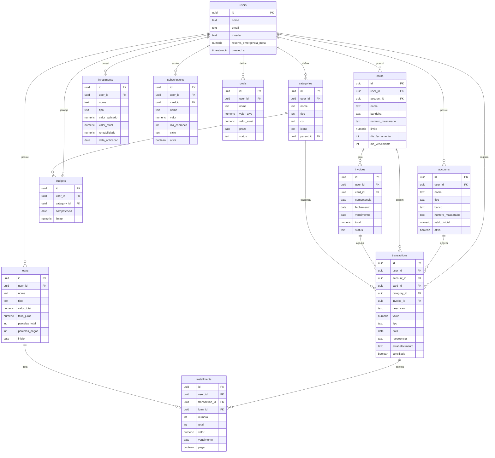

# Diagrama Entidade-Relacionamento — FinControl AI

Renderiza automaticamente no GitHub (Mermaid).

> Observação: `users` reflete a tabela de perfil da aplicação. O `id` corresponde ao
> `auth.users.id` do Supabase (relação 1-1), permitindo o uso de `auth.uid()` nas políticas RLS.
